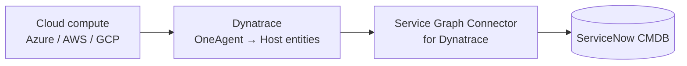
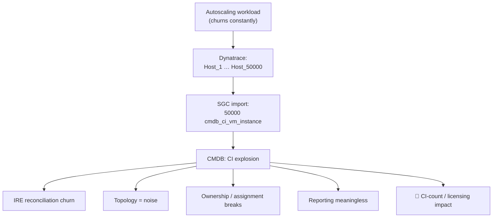
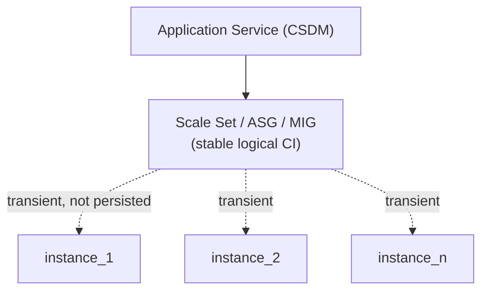
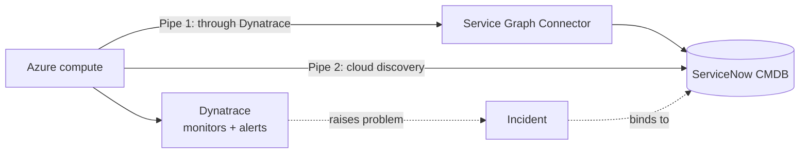

# When Ephemeral Compute Meets a Static CMDB

### An observability-to-CMDB anti-pattern — and how to fix it with Dynatrace and ServiceNow

*A practitioner's guide for anyone wiring Dynatrace topology into the ServiceNow CMDB.*

---

## TL;DR

The CMDB was designed for things that **persist**. Cloud autoscaling was designed for things that **don't**. When you pipe observability straight into the CMDB, those two worldviews collide — and the CMDB loses: CI explosion, reconciliation churn, unusable topology, and a licensing bill to match.

The fix isn't "turn off discovery." It's to **insert an abstraction layer**: model the *workload* (the scale set / auto-scaling group / node pool) and the *service*, and let the individual ephemeral instances stay out of the system of record. Model **intent and service structure, not runtime noise**.

**A note on scope.** The *problem* here is well-trodden — ephemeral compute versus the CMDB has been written about plenty. What stays under-discussed is the *fix*, and that's where this piece spends its time. And the fix is **not** "rip out the CMDB and buy a real-time cloud CMDB" — it's a modelling discipline *inside* the Dynatrace + ServiceNow stack you already run.

---

## The pipeline everyone builds

A very common, very reasonable integration:

OneAgent goes on the hosts, Dynatrace builds the topology, the **Service Graph Connector (SGC)** imports that topology into ServiceNow, and the CMDB lights up. For stable estates this is great.

Then someone points it at an autoscaling workload.

---

## The anti-pattern

Autoscaling means compute is **created and destroyed continuously** — VM Scale Sets (Azure), Auto Scaling Groups (AWS), Managed Instance Groups (GCP), Kubernetes node pools and pods. Each instance is short-lived and, crucially, **modelled as a first-class asset all the way down the chain**:

| Layer | What it does with an ephemeral instance |
|---|---|
| **Cloud** | Spins up a unique VM with its own identity and lifecycle; tears it down minutes/hours later |
| **Dynatrace** | OneAgent registers it as a **HOST** entity; the entity persists for the retention window even after the host is gone |
| **ServiceNow (SGC)** | The connector imports every host → one `cmdb_ci_vm_instance` (or `cmdb_ci_computer`) each |
| **CMDB** | Thousands of CIs: live, dead, and duplicate — with no service structure connecting them |

The damage isn't just volume. It's:

- **IRE churn** — a relentless create/update/delete stream into the Identification and Reconciliation Engine, with stale records and reconciliation noise.
- **Useless topology** — "top 10 hosts" and dependency maps become statistical artifacts of whatever was alive at query time.
- **Broken ownership** — you can't assign, support, or report on a CI that lived for 40 minutes.
- **Cost** — CMDB CI counts and downstream licensing scale with the noise, not the value.

> **Why is OneAgent on every instance in the first place?** It rides the same automation that creates the instance — baked into the VM image, attached as an Azure scale-set extension, or run as a Kubernetes DaemonSet — so a new instance is monitored the moment it boots, with no separate deploy step. Monitoring scales at the speed of provisioning. That's the crux: the same frictionless automation that makes "observe everything, instantly" possible is exactly what mints a fresh Host entity for every ephemeral instance — and, left unchecked, a fresh CI.

---

## The real root cause

It's tempting to blame Dynatrace or the connector. Both are doing exactly what they're told. The actual failure is architectural:

> **There is no abstraction layer between runtime compute and the CMDB.**

The CMDB is being asked to store **runtime state** — which instances happen to exist right now — when its job is to store **intent and structure**: what services exist, what they depend on, who owns them. Runtime state belongs in the observability platform, which is built for high-cardinality, short-lived entities. The CMDB is not.

---

## The fix: model the grouping, not the instance

Every cloud autoscaling primitive already gives you the abstraction you need — a **logical, stable unit** that owns the ephemeral instances:

| Cloud | Stable grouping unit |
|---|---|
| Azure | VM Scale Set (VMSS) |
| AWS | Auto Scaling Group (ASG) |
| GCP | Managed Instance Group (MIG) |
| Kubernetes | Deployment / node pool |

The instances under it come and go; **the group persists**. That's your CMDB anchor.

**What to persist — the admission rule:**

| Layer | Source | Persist in CMDB? |
|---|---|---|
| Service / Application Service | Dynatrace topology | ✅ Yes |
| Scale set / workload / node pool | Cloud + Dynatrace | ✅ Yes — one stable CI |
| Individual instances | Cloud / Dynatrace | ❌ No (or a short-TTL transient layer only) |

The result: **one CI per workload instead of tens of thousands**. A clean `Service → Workload → (optional transient)` topology. IRE with nothing to churn on. Ownership and assignment that mean something. And a CI count that tracks your architecture, not your traffic.

> **Necessary, but not sufficient.** Scale sets fix the *origin* — they treat ephemeral compute as a managed group instead of thousands of pets, giving you a stable object to model and real lifecycle control. Had the workload been a scale set from day one, most of this never starts. But scale sets alone **do not** keep the CMDB clean: OneAgent still runs on every instance, so Dynatrace still creates a host entity per instance, and the connector will still import each one **unless you also make the modelling decision** — persist the scale set, exclude the instances. Scale sets with naïve host import produce the *same* explosion, just with a parent. The complete fix is **both**: the grouping upstream **and** the admission rule downstream.

### Scale set vs. spinning VMs up and down — the counter-intuitive part

At the raw agent/entity level, **there is no difference**. Each scale-set instance still runs its own OneAgent and still becomes its own Host entity. 50 scale-set instances = 50 Host entities, exactly like 50 standalone VMs. The scale set does not reduce agent count or entity count — deployment-wise it looks identical to a fleet of ad-hoc VMs. That's precisely why it's "necessary but not sufficient."

Where they diverge is **how the agent gets there** and **what metadata each host carries**:

| | Scale set (VMSS / ASG / MIG) | Ad-hoc VMs |
|---|---|---|
| **Deployment** | OneAgent declared once — a scale-set extension or baked into the shared image. Azure guarantees every instance gets it, identically, at provision time. You *can't* have an instance without it. | Each install is its own act. Room for drift — a missing agent, a stale version, the wrong host group, a forgotten manual step. Coverage is best-effort, not structural. |
| **Grouping metadata** | Every instance carries cloud metadata identifying it as a member of the same set (scale-set name, resource group, subscription). OneAgent stamps each Host entity with it, so Dynatrace knows the 50 churning hosts are **one logical group** — the handle for host groups, management zones, tags, aggregation. | No shared parent metadata. Dynatrace sees 50 unrelated hosts. Nothing signals they belong together — unless you hand-tag every one. |
| **Anchor** | The set itself is a persistent object with predictable instance naming and scale-in/out as a first-class operation. The instances are cattle; **the set is the pet.** Dynatrace and the CMDB anchor on the set while instances churn beneath it. | Every VM is a pet with its own identity and lifecycle. Every spin-up is a brand-new unrelated host; every teardown an independently-stale entity. Nothing stable to anchor to. |

The bottom line: to OneAgent, a scale set and a pile of ad-hoc VMs are the same — one agent, one Host entity per instance. What the scale set adds is a **shared metadata key that gives Dynatrace a stable grouping handle over the churn**. That handle is exactly what lets you push **one CI to the CMDB instead of thousands**. The scale set doesn't stop the entity churn — it gives you the identity to model *above* it. Which is the whole point of "necessary but not sufficient": the grouping buys you nothing downstream unless you also make the modelling decision to persist the set and drop the instances.

### How each platform supports this

- **Dynatrace** still monitors every instance (you want that telemetry) — but it can **group** them into a stable picture using cloud metadata, **host groups**, **tags**, and process-group/service detection. You report and alert at the service/host-group level; the instance churn stays underneath, where it belongs.
- **ServiceNow** imports the **group and the service**, not the instances. Map the scale set to a single logical CI and relate it into the **Application Service** in CSDM. The CMDB now reflects the service model — exactly what it's for.

---

## Where the CI comes from — and where the incident binds

Keeping the CMDB clean is one decision. There's a second one underneath it that decides *how a Dynatrace problem ever lands on a CI*: **who sources the CI in the first place.**

In a cloud estate you usually have two pipes that can populate ServiceNow, while Dynatrace monitors the workload regardless — one *through* Dynatrace, one straight from the cloud's own discovery:

That leaves two ways to get the incident onto the right CI.

### Way A — source the CI from Dynatrace

Dynatrace is both the CI source (via the connector) and the alert source. When it raises a problem, the incident binds to the CI Dynatrace itself created — the alert already carries that entity's ID, so the join is automatic.

| Pros | Cons |
|---|---|
| One pipe to build and run — same source for CI and alert | Dynatrace becomes a CMDB-population source, so you inherit every CI-explosion / filtering / class-mapping problem above |
| Binding is free — no cross-source matching to maintain | CI provenance is *monitoring*, not authoritative inventory: only agent-instrumented resources ever become CIs |
| Dynatrace's runtime topology (process/service chain) enriches the CMDB | Host-entity churn and retention windows leak into the CMDB unless you actively control them |
| Strong when Dynatrace is the most complete picture of what's actually running | Collides with cloud discovery if that also runs — two sources, one CI, reconciliation conflicts |

### Way B — source the CI from cloud discovery, match the alert

Don't let Dynatrace populate the CMDB at all. The cloud's own discovery pipe owns the CI; Dynatrace is demoted to a pure signal source. When it alerts, you **match** the entity it's alerting on to the already-present cloud-sourced CI via a shared key (cloud resource ID, FQDN, hostname, IP) and bind the incident there.

| Pros | Cons |
|---|---|
| Dynatrace stays out of the CMDB — the entire pollution problem above disappears for this path | You now own a **reliable match** at alert-time; a missed match is an unbound incident |
| CI provenance is the authoritative cloud inventory — real resource IDs, full coverage, including resources Dynatrace never sees | Both systems must agree on a stable shared key; naming or identity drift breaks the join |
| Clean separation of concerns: discovery owns identity and structure, Dynatrace owns runtime signal | Dynatrace's dependency topology no longer enriches the CMDB for free |
| One source of CI truth → simpler reconciliation | The cloud CI must exist when the alert arrives, or the match fails |

### Which one?

It comes down to what you're optimising for: a **single pipe with automatic binding** (A), or **clean separation with the cloud as the CI authority** (B). Weigh it against the reliability of your correlation key, whether Dynatrace's topology earns its place in the CMDB, and how much un-instrumented cloud estate you need represented. Both land incidents on CIs — they just disagree on *who owns the CI*. Decide that first, and the rest follows.

---

## If you can't change the cloud architecture

Sometimes you don't own the Azure/AWS estate and scale sets aren't on the table. You can still defend the CMDB at the integration seam. Treat the import as a **contract** that decides what is allowed to persist:

**On the Dynatrace side**
- Apply an **automated tag** to ephemeral hosts (e.g. `lifecycle:ephemeral`) using naming patterns, cloud metadata, or host-group rules.
- Keep the noisy detail in Dynatrace; expose only grouped/service-level entities to the export.

**On the ServiceNow / SGC side**
- **Filter at import** — scope the connector, or drop ephemeral hosts in the import-set transform, so they never reach `cmdb_ci_*`.
- **Identification rules** — make the IRE ignore short-lived hosts, or route them to a **quarantine/staging** area instead of the production CMDB.
- **Don't persist what you can't own** — if a CI's expected lifetime is shorter than your reconciliation cycle, it doesn't belong in the system of record.

This is the same principle as the architectural fix, enforced one layer later: **the ingestion contract decides what enters the CMDB** — and ephemeral compute doesn't, except as a group.

---

## A reusable test: does this belong in the CMDB?

Before any source feeds the CMDB, ask:

1. **Does it persist** longer than your reconciliation cycle? If not → don't store it as a CI.
2. **Can someone own it?** If no human or team can be accountable for it → it's runtime state, not a configuration item.
3. **Does it represent intent**, or just "what happened to be running"? The CMDB models the former.
4. **Is there a stable parent** that already represents it (a service, a workload, a scale set)? Model that instead.

If the answer is "store the instances anyway," you're using the CMDB as a metrics database — and you already have one of those.

---

## The principle, in one line

> **The CMDB should represent intent and service structure — not runtime noise.**

Ephemeral compute isn't a CMDB problem to absorb; it's a modelling decision to make. Put the abstraction layer where it belongs — the scale set as the unit, the service as the structure — and the same pipeline that produced "instance-level chaos" produces **service-level clarity** instead.

---

*Written for the Dynatrace and ServiceNow practitioner communities. Product specifics (OneAgent host entities, the Service Graph Connector for Dynatrace, the Identification and Reconciliation Engine, and CSDM) are referenced at a conceptual level — validate exact class names, connector scoping options, and IRE behaviour against your platform versions before implementing.*

*Concept and direction by Victor Andreev, developed in collaboration with Claude (Anthropic).*
